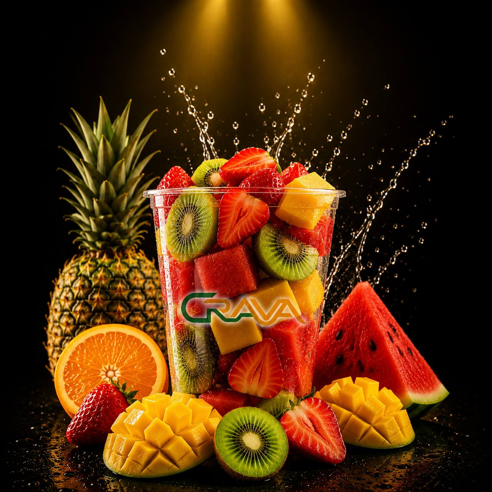

<html lang="ckb" dir="rtl">
<head>
<meta charset="UTF-8">
<meta name="viewport" content="width=device-width, initial-scale=1.0">
<title>CRAVA </title>
<meta name="description" content="کڕاڤە - شیرەی میوەی تازە و پەتاتەی گەرم، تەنها بۆ بردنەوە لە شەقامی کاوا">

<!-- Fonts: Noto Kufi Arabic for display headings, Vazirmatn for body text — both have full Kurdish/Sorani glyph support -->
<link rel="preconnect" href="https://fonts.googleapis.com">
<link rel="preconnect" href="https://fonts.gstatic.com" crossorigin>
<link href="https://fonts.googleapis.com/css2?family=Noto+Kufi+Arabic:wght@500;700;800;900&family=Vazirmatn:wght@400;500;600;700&display=swap" rel="stylesheet">

</head>
<body>

<!-- ================= NOISE / GRAIN OVERLAY (purely decorative texture) ================= -->

<!-- ================= HEADER ================= -->
<header class="site-header" id="siteHeader">
  

    

    <nav class="main-nav" id="mainNav">
      <a href="#juices">شەربەتی میوە</a>
      <a href="#icecrava">ئایسکراڤا</a>
      <a href="#fries">پەتاتە</a>
      <a href="#sauces">سۆسەکان</a>
      <a href="#footer">پەیوەندی</a>
    </nav>

    <button class="menu-toggle" id="menuToggle" aria-label="کردنەوەی مینیو" aria-expanded="false">
      
    </button>
  

</header>

<!-- ================= HERO ================= -->
<section class="hero" id="hero">
  <!-- ambient glow blobs -->
  

  

  <!-- floating fruit / fry particles -->
  

    🍊
    🍓
    🥝
    🍍
    🍉
  

  

    

    

    <h1 class="hero-title reveal-up delay-2">
    بەخێربێن  
       بۆ کڕاڤا 
    </h1>
    
شەربەتی میوەی فرێش و پەتاتەی گەرمی تازە بە جۆرەها تامی جیاواز لەگەڵ CRAVA تاقی بکەرەوە.
    

    

      <a href="#juices" class="btn btn-primary">
        بینینی مینیو
        <svg width="18" height="18" viewBox="0 0 24 24" fill="none"><path d="M12 5v14M5 12l7 7 7-7" stroke="currentColor" stroke-width="2.4" stroke-linecap="round" stroke-linejoin="round"/></svg>
      </a>
      <a href="#footer" class="btn btn-ghost">شوێنمان بزانە</a>
    

  

  

</section>

<!-- ================= SIGNATURE WAVE DIVIDER ================= -->

  <svg viewBox="0 0 1200 60" preserveAspectRatio="none">
    <path d="M0,30 C150,60 350,0 600,30 C850,60 1050,0 1200,30 L1200,60 L0,60 Z" fill="url(#waveGrad1)"/>
    <defs>
      <linearGradient id="waveGrad1" x1="0" y1="0" x2="1" y2="0">
        <stop offset="0%" stop-color="#1B4D2E"/>
        <stop offset="100%" stop-color="#F5A623"/>
      </linearGradient>
    </defs>
  </svg>

<!-- ================= JUICE SECTION ================= -->
<section class="juices" id="juices">
  

    

      
تازە · سروشتی · بەبێ شەکری زیادە

      <h2 class="section-title reveal-up">شیرەی میوەی تازە</h2>
      
١٥ جۆر شیرەی میوەی تازە، هەر ڕۆژێک لە میوەی ڕەسەن دروست دەکرێت.

    

    

      

        
        

          ١٠٠٪
          میوەی سروشتی
        

      

      

        <h3>لە میوە بۆ گیلاس، لەبەردەم چاوت</h3>
        
هەموو شیرەیەک لە میوەی تازەی ئەو ڕۆژە دروست دەکرێت، بەبێ کۆنسێرڤ و بەبێ شەکری دەرەکی. تامی ڕاستەقینەی میوە، هەر کاتێک پێویستت پێی بوو.

      

    

    

      <!-- 15 juice items — placeholder names & prices, easy to swap later.
           Each card photo is a plain : just replace the file in images/juice/
           (keep the same filename) with your own JPG to update the photo. -->
      <article class="juice-card">

<h4>شیرەی پرتەقاڵ</h4>٢٥٠٠ د.ع</article>
      <article class="juice-card">

<h4>شیرەی لیمۆ و نەعنا</h4>٢٥٠٠ د.ع</article>
      <article class="juice-card">

<h4>شیرەی تووی فەرەنگی</h4>٣٠٠٠ د.ع</article>
      <article class="juice-card">

<h4>شیرەی مانگۆ</h4>٣٠٠٠ د.ع</article>
      <article class="juice-card">

<h4>شیرەی بەتیخ</h4>٢٠٠٠ د.ع</article>
      <article class="juice-card">

<h4>شیرەی ئەناناس</h4>٣٠٠٠ د.ع</article>
      <article class="juice-card">

<h4>شیرەی کیوی</h4>٣٥٠٠ د.ع</article>
      <article class="juice-card">

<h4>شیرەی سێو</h4>٢٥٠٠ د.ع</article>
      <article class="juice-card">

<h4>شیرەی تیرێ</h4>٣٠٠٠ د.ع</article>
      <article class="juice-card">

<h4>شیرەی شەفتاڵوو</h4>٣٠٠٠ د.ع</article>
      <article class="juice-card">

<h4>شیرەی هەنار</h4>٣٥٠٠ د.ع</article>
      <article class="juice-card">

<h4>شیرەی مۆز و شیر</h4>٣٠٠٠ د.ع</article>
      <article class="juice-card">

<h4>شیرەی گێلاس</h4>٣٥٠٠ د.ع</article>
      <article class="juice-card">

<h4>شیرەی گوێز و نارگیل</h4>٣٥٠٠ د.ع</article>
      <article class="juice-card featured">

<h4>تایبەتی کڕاڤە — تێکەڵی گەرمسێری</h4>٤٠٠٠ د.ع</article>
    

  

</section>

<!-- ================= WAVE DIVIDER (juice → icecrava) ================= -->

  <svg viewBox="0 0 1200 60" preserveAspectRatio="none">
    <path d="M0,30 C150,60 350,0 600,30 C850,60 1050,0 1200,30 L1200,60 L0,60 Z" fill="url(#waveGrad3)"/>
    <defs>
      <linearGradient id="waveGrad3" x1="0" y1="0" x2="1" y2="0">
        <stop offset="0%" stop-color="#FCEFD2"/>
        <stop offset="100%" stop-color="#F5A623"/>
      </linearGradient>
    </defs>
  </svg>

<!-- ================= ICECRAVA SECTION (single item, directly under Juices) ================= -->
<section class="icecrava" id="icecrava">
  

    

      
نوێ · سارد و کرێمی

      <h2 class="section-title reveal-up">ICECRAVA</h2>
      
ئایسکریمی تایبەتی کڕاڤە — یەک تامی نایاب، دروستکراو لە کاوا ستریت.

    

    

      

        
      

      

        تاکە تام
        <h3>ئایسکڕیمی کڕاڤە</h3>
        
کرێمی سارد و نەرم، تێکەڵ لەگەڵ تامی میوەی تازە و تامی تایبەتی کڕاڤە. کۆتایی خۆشی ژەمەکەت.

        ٣٥٠٠ د.ع
      

    

  

</section>

<!-- ================= WAVE DIVIDER (inverted, into dark fries section) ================= -->

  <svg viewBox="0 0 1200 60" preserveAspectRatio="none">
    <path d="M0,30 C150,0 350,60 600,30 C850,0 1050,60 1200,30 L1200,60 L0,60 Z" fill="url(#waveGrad2)"/>
    <defs>
      <linearGradient id="waveGrad2" x1="0" y1="0" x2="1" y2="0">
        <stop offset="0%" stop-color="#F5A623"/>
        <stop offset="100%" stop-color="#0F2116"/>
      </linearGradient>
    </defs>
  </svg>

<!-- ================= FRIES SECTION ================= -->
<section class="fries" id="fries">
  

  

    

      
ترسکە · گەرم · تازە سرخکراو

      <h2 class="section-title reveal-up">پەتاتەی کڕاڤە</h2>
      
٥ جۆری تایبەت، هەموویان تازە دەسرخرێن دوای داواکردن.

    

    

      

        
      

      

        <article class="fries-card reveal-up">
          

          

            <h4>پەتاتەی کلاسیک</h4>
            
پەتاتەی ترسکەی سادە لەگەڵ خوێی تایبەت

          

          ٢٠٠٠ د.ع
        </article>
        <article class="fries-card reveal-up">
          

          

            <h4>پەتاتەی پەنیر</h4>
            
داپۆشراو بە سۆسی پەنیری گەرم

          

          ٣٠٠٠ د.ع
        </article>
        <article class="fries-card reveal-up">
          

          

            <h4>پەتاتەی تیخ</h4>
            
بەهاراتی تیژ بۆ ئەوانەی حەز لە تام دەکەن

          

          ٢٥٠٠ د.ع
        </article>
        <article class="fries-card reveal-up">
          

          

            <h4>پەتاتەی سیر و مایۆنێز</h4>
            
تامێکی کرێمی لەگەڵ بۆنی سیری تازە

          

          ٢٥٠٠ د.ع
        </article>
        <article class="fries-card reveal-up featured">
          

          

            <h4>پەتاتەی تایبەتی کڕاڤە</h4>
            
تێکەڵەی هەموو سۆسەکان + پارچە گۆشتی تایبەت

          

          ٤٥٠٠ د.ع
        </article>
      

    

  

</section>

<!-- ================= SAUCES SECTION (directly under fries) ================= -->
<section class="sauces" id="sauces">
  

    

      
تاماوییەکان

      <h2 class="section-title reveal-up">سۆسەکان</h2>
      
هەر سۆسێک بە تامێکی جیاواز، هاوڕێی چاکی پەتاتەکەت.

    

    <ul class="sauce-list">
      <li class="sauce-item reveal-up">کێچەپ٥٠٠ د.ع</li>
      <li class="sauce-item reveal-up">مایۆنێز٥٠٠ د.ع</li>
      <li class="sauce-item reveal-up">سۆسی تایبەتی کڕاڤە٧٥٠ د.ع</li>
      <li class="sauce-item reveal-up">سۆسی تیخ٥٠٠ د.ع</li>
      <li class="sauce-item reveal-up">سۆسی سیر٥٠٠ د.ع</li>
    </ul>
  

</section>

<!-- ================= TAKEAWAY STRIP ================= -->
<section class="takeaway-strip">
  

    

      کراڤا•
      شەربەتی میوەی فريش•
      پەتاتەی گەرمی تازە•
  
    

  

</section>

<!-- ================= FOOTER ================= -->
<footer class="site-footer" id="footer">
  

    

      
      

    

    

      <h5>شوێنمان</h5>
      

      
 شەقامی کاوە(حریق)-بەرامبەر LC Waikiki 

    

    

      <h5>کراوەیە لە</h5>
      

      
٤:٠٠ دوای نیوەڕۆ  تاوەکو  ١٢:٠٠ شەو

    

 
    

      <h5>لەگەڵمان بن</h5>
      

        <a href="https://www.instagram.com/crava.krd?igsh=MWlodnU3aW9oa3Q5ag%3D%3D&utm_source=qr" class="social-icon" aria-label="ئینستاگرام">
          <svg width="20" height="20" viewBox="0 0 24 24" fill="none"><rect x="3" y="3" width="18" height="18" rx="5" stroke="currentColor" stroke-width="1.8"/><circle cx="12" cy="12" r="4" stroke="currentColor" stroke-width="1.8"/><circle cx="17.5" cy="6.5" r="1.2" fill="currentColor"/></svg>
        </a>
        <a href="#" class="social-icon" aria-label="فەیسبووک">
          <svg width="20" height="20" viewBox="0 0 24 24" fill="none"><path d="M14 8.5h2.5V5h-2.5c-2.2 0-4 1.8-4 4v2H8v3.5h2.5V21h3.5v-6.5h2.5l.5-3.5h-3V9c0-.6.4-.5 1-.5z" stroke="currentColor" stroke-width="1.5" stroke-linejoin="round"/></svg>
        </a>
        <a href="#" class="social-icon" aria-label="تیک تۆک">
          <svg width="20" height="20" viewBox="0 0 24 24" fill="none"><path d="M15 3c.4 2.2 2 3.8 4 4v3c-1.5 0-2.9-.4-4-1.2V15a5 5 0 1 1-5-5v3a2 2 0 1 0 2 2V3h3z" stroke="currentColor" stroke-width="1.5" stroke-linejoin="round"/></svg>
        </a>
        <a href="#" class="social-icon" aria-label="واتساپ">
          <svg width="20" height="20" viewBox="0 0 24 24" fill="none"><path d="M12 21a9 9 0 1 0-7.8-4.5L3 21l4.6-1.2A9 9 0 0 0 12 21z" stroke="currentColor" stroke-width="1.5" stroke-linejoin="round"/><path d="M8.5 9.5c0 4 3 6.5 6.5 6.5.6 0 1.5-.2 1.5-1v-1.3l-2-1-1 1c-1-.4-2.2-1.6-2.7-2.7l1-1-1-2H9c-.4 0-.5.7-.5 1.5z" fill="currentColor"/></svg>
      <!-- Snapchat -->
<a href="https://www.instagram.com/crava.krd?igsh=MWlodnU3aW9oa3Q5ag%3D%3D&utm_source=qr" target="_blank" class="social-icon" aria-label="سنەپچات">
  <svg width="20" height="20" viewBox="0 0 24 24" fill="currentColor">
    <path d="M12 2c-2.5 0-4.5 2-4.5 4.5v2c0 .5-.3 1-.8 1.2l-1 .5c-.3.2-.4.6-.2.9.4.5 1 .8 1.6.9.4.1.7.5.6.9-.3 1.4-1.3 2.5-2.6 2.9-.2.1-.3.3-.2.5.3.5 1 .8 1.7.8.7 0 1.3.4 1.6 1 .4.8 1.2 1.3 2.1 1.3h3.4c.9 0 1.7-.5 2.1-1.3.3-.6.9-1 1.6-1 .7 0 1.4-.3 1.7-.8.1-.2 0-.4-.2-.5-1.3-.4-2.3-1.5-2.6-2.9-.1-.4.2-.8.6-.9.6-.1 1.2-.4 1.6-.9.2-.3.1-.7-.2-.9l-1-.5c-.5-.2-.8-.7-.8-1.2v-2C16.5 4 14.5 2 12 2z"/>
  </svg>
</a>
    
        </a>
      

    

  

  

    
© ٢٠٢٦ کڕاڤە.   

  

</footer>

</body>
</html>
